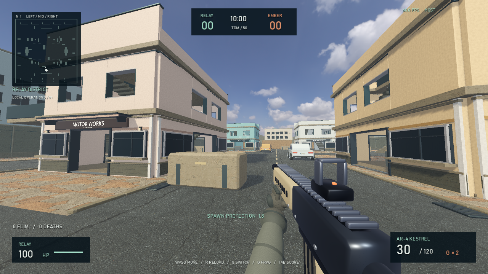
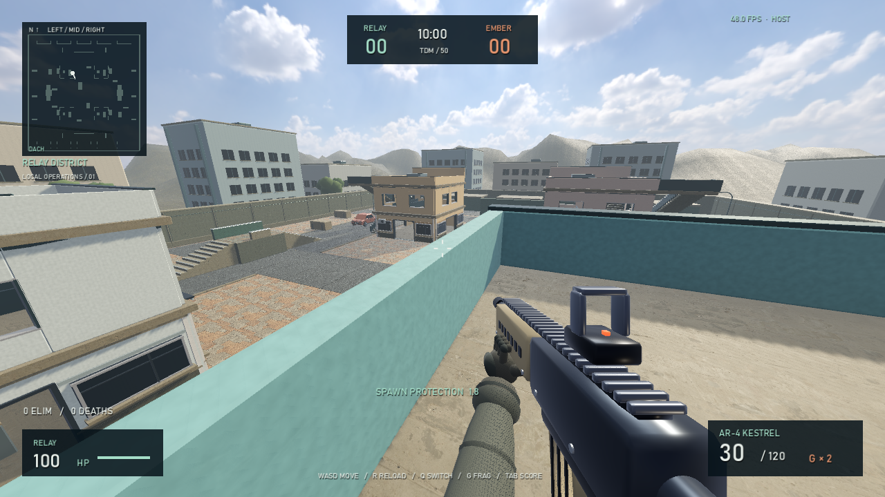

# Größere Karte und begehbare Etagen

Stand: 8. September 2026. Relay District wächst von ungefähr **60 × 86 auf 72 × 100 Meter**. Zusätzliche Seitenhöfe, Deckungen und zwei Querstraßen ergänzen die drei bisherigen Lanes. Die vier bestehenden Hauptgebäude bleiben an ihren bekannten Positionen; Stil, Waffen und Matchregeln bleiben erhalten.

## Ziel und eingebautes Verhalten

Jedes Hauptgebäude besitzt jetzt ein Erdgeschoss, ein Obergeschoss auf **3,7 m** und ein begehbares Dach auf **7,4 m**. Die Innenräume bleiben kompakt. Im Obergeschoss sind echte offene Fenster mit Brüstung und Rahmen eingebaut: Schüsse werden dort nicht von unsichtbaren Wänden oder Glasscheiben blockiert. Die Erdgeschossfenster bleiben die bisherigen geschlossenen Fassadenfenster.

**Innenweg:** Das Gebäude durch einen Erdgeschosseingang betreten. Die erste Treppe verläuft innen auf der rechten Gebäudeseite. Oben über den hinteren Treppenabsatz zur zweiten, gegenüberliegenden Treppe wechseln; diese führt aufs Dach. Beide Wege sind auch abwärts nutzbar.

**Außenweg:** An der zur äußeren Lane gerichteten Gebäudeseite befindet sich eine zweiläufige Außentreppe. Der erste Absatz besitzt einen Seiteneingang ins Obergeschoss. Der zweite Lauf erreicht einen separaten Dachzugang. Damit lässt sich eine besetzte Innentreppe umgehen.

Dachbrüstungen erlauben Deckung und Beschuss zur Kartenmitte. Höhere rückwärtige Sichtblenden und zentrale Dachtechnik unterbrechen freie Sichtlinien. Die zehn Spawnpunkte liegen weiter außen unter Unterständen mit Frontblende und kurzen seitlichen Rückwänden. Seitliche Ausgänge bleiben erreichbar. Die dynamische Spawnwahl läuft weiterhin zusätzlich.

Die Minimap ist an die neuen Grenzen angepasst und zeigt beim eigenen Spieler **1. OBERGESCHOSS** oder **DACH** an. Die Boden-Navigation berücksichtigt jetzt auch die nötige Körperhöhe unter Treppen. Bots benutzen weiterhin vorwiegend ihre vorhandenen Bodenrouten; ihre Sichtprüfung und Zielerfassung funktionieren auch gegen erhöhte Gegner. Eine mehrstöckige Bot-Routenplanung ist nicht Teil dieser Kartenänderung.

## Dateien, Klassen und vollständiger Code

| Datei / Klasse | Aufgabe |
|---|---|
| [arena.gd](../scripts/arena.gd), `RelayArena` | Größere Grenzen, Boden und Straßen, zusätzliche Deckungen, Spawn-Unterstände, Navigation und Einbau der Etagen |
| [urban_floors.gd](../scripts/urban_floors.gd), `UrbanFloors` | Gemeinsame Definition von sichtbarer Geometrie und Kollision: offene Etagenböden, Fenster, Innen-/Außentreppen, Geländer, Dachdeckungen |
| [urban_architecture.gd](../scripts/urban_architecture.gd), `UrbanArchitecture` | Erhält die Erdgeschossfassaden; entfernt den früheren geschlossenen Dachaufbau zugunsten der nutzbaren Etagen |
| [urban_details.gd](../scripts/urban_details.gd), `UrbanDetails` | Versetzte Umfassungsmauerdetails, Hintergrundgebäude, Leitungen und Bäume außerhalb der größeren Arena |
| [hud.gd](../scripts/hud.gd), `ArenaHUD`; [ui.gd](../scripts/ui.gd), `GameUI` | Angepasste Minimap, Höhenanzeige und Kartenmaße im Menü |

Die Dateien enthalten den vollständigen eingebauten Code. Es werden keine weiteren Modelle, Plugins oder Scene-Verknüpfungen benötigt.

## Einbau und Start

Die Änderungen sind bereits in das Projekt eingebaut. Das Spiel beenden und **Start-Game.exe** neu starten; der Starter importiert die neue Klasse automatisch. Für LAN-Matches den gleichen aktualisierten Projektordner auf alle Rechner kopieren. Alte und neue Kartenstände sollen nicht gemeinsam spielen, da sich ihre Kollisionen unterscheiden.

## Ausgeführte Tests

- **53/53 neue Kartenprüfungen bestanden:** erweiterte Navigation, fünf Nord-Süd-Routen, Ausgänge aller zehn Spawns, tatsächlicher CharacterBody-Aufstieg über alle Innen- und Außentreppen, obere Seitentüren, Dachzugänge, Abstieg, offene Schussfenster und Sicht zur Kartenmitte.
- Die Spawn-Sichtprüfung verwendet pro Gebäude 30 erhöhte Ausgangspunkte einschließlich Außenpositionen und Sprunghöhe. Alle zehn Spawn-Mittelpunkte waren vor diesen insgesamt **1.200 Teststrahlen** geschützt. Das ist eine geometrische Stichprobe, keine Garantie gegen jedes mögliche Spawn-Camping.
- **34 Gameplay-, 27 Waffen-/Bot- und 38 Grafikprüfungen** sowie die Figurenprüfung bestanden weiterhin.
- Der reguläre Host-/Client-Test bestand. Ein zusätzlicher **Etagen-Netzwerktest** ließ einen separaten Client auf der Host-Simulation eine Innentreppe hinauflaufen und bestätigte die empfangene Obergeschossposition. Beide Tests liefen auf Loopback desselben PCs.
- Die erweiterte Map wurde mit Godot 4.5 Forward+ grafisch gestartet und als Straßen-, Treppen-, Obergeschoss-, Fenster-, Dach- und Spawnansicht aufgenommen. Aktuelle Dateien: `docs/expansion-*.png`. Protokoll: `tests/expansion-visual.log`.

Die kurzen FPS-Stichproben nach drei Sekunden Aufwärmzeit lagen mit sieben aktiven Bots auf einer **GTX 1080 bei 1280 × 720 und aktivem VSync** in allen drei Grafikstufen bei **60 FPS** (je drei Ein-Sekunden-Stichproben). Während der vorherigen schnellen Kamerawechsel lagen einzelne Werte zwischen **46 und 60 FPS**. Das belegt keinen durchgehenden Mindestwert. Im eingeschränkten Arbeitsbereich meldete Godot den unzugänglichen Zertifikatsspeicher und zweimal einen nicht schreibbaren Shader-Cache; die Bildaufnahmen und der Spieltest liefen durch, ohne GDScript-Laufzeitfehler.

```powershell
./tests/Run-Tests.ps1
./tests/Run-VerticalLan.ps1
./tools/godot/Godot_v4.5-stable_win64_console.exe --path . --log-file ./tests/expansion-visual.log --script tests/expansion_visual.gd
```

Der letzte Befehl erstellt sechs Spielansichten und kurze FPS-Stichproben mit sieben Bots. Ein länger laufendes menschliches 4v4-Match bleibt für die Bewertung von Waffenbalance, Dachdominanz, Spawn-to-Contact-Zeiten und Performance erforderlich.

## Bilder





## Typische Fehler und manuelle Abnahme

- **Alte Karte sichtbar:** Die laufende Spielinstanz schließen und aus dem aktualisierten Projektordner neu starten. Auch LAN-Mitspieler brauchen diesen Stand.
- **Neue Klasse nicht gefunden:** Über den mitgelieferten Starter importieren oder Godot 4.5 im Editor öffnen und den Import abwarten.
- **Schüsse treffen eine Brüstung:** Im Stehen durch die offenen Obergeschossfenster beziehungsweise über die niedrige Dachkante zielen. Rückwärtige Dachblenden sind absichtlich höher.
- **Treppenausgang nicht gefunden:** Am Ende des Innenlaufs erst auf den vollständigen Absatz gehen und dort zur gegenüberliegenden Treppe wechseln. Die Treppenöffnungen besitzen reale Geländer.
- **Niedrigere Bildrate:** SETTINGS → Performance testen. Größere Sichtfelder von den Dächern und zusätzliche Etagen erhöhen den Grafikaufwand. Kurze FPS-Stichproben ersetzen keinen Langzeitbenchmark.

Für die manuelle Abnahme alle vier Gebäude über beide Zugänge begehen, Fenstergefechte mit einem zweiten Spieler testen und jeweils die Gegenroute zur Dachposition nutzen. Anschließend auf zwei physischen LAN-Rechnern spielen; die automatisierten Netzwerktests prüfen keine WLAN- oder Firewall-Konfigurationen.
