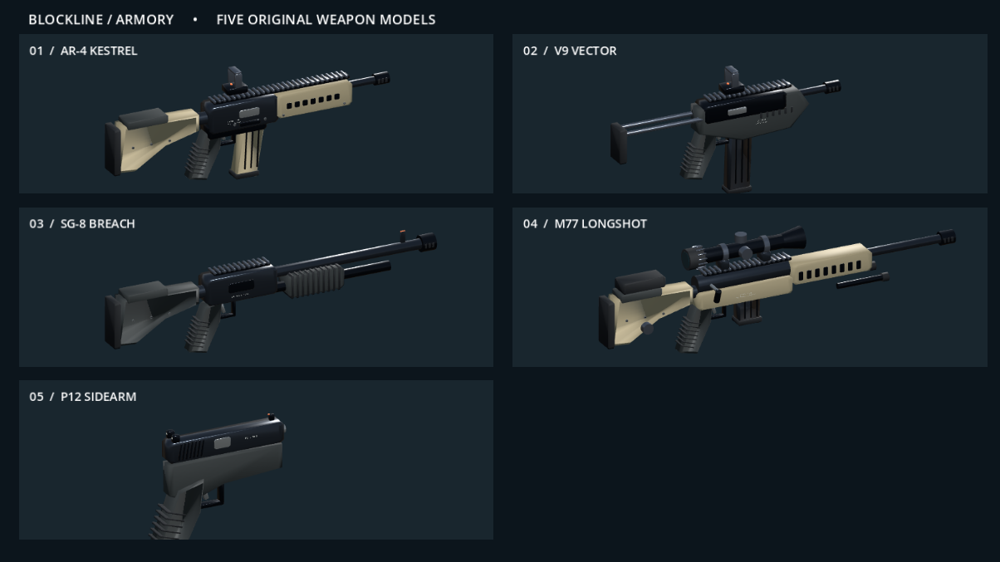

# Startkorrektur, Bot-Schwierigkeit und Waffen-Redesign

Stand: 8. September 2026, zweite Iteration.

## Spiel starten

**`Start-Game.exe` im Hauptordner doppelklicken.** Die kleine native Windows-Anwendung startet Godot ohne Batch- oder PowerShell-Abhängigkeit. Zuerst führt sie einen stillen Projektimport aus, damit auch eine frische Kopie ohne `.godot`-Cache die neuen Scriptklassen korrekt registriert. Danach öffnet sie das Spiel. Bei Importfehlern erscheint eine verständliche Meldung; Details liegen unter `logs/import.log`, `logs/game.log` bzw. `logs/launcher-error.txt`.

Die vorhandene CMD-Datei wurde auf den EXE-Starter umgestellt und mit Windows-Zeilenenden gespeichert. In der untersuchten Umgebung fehlt `C:\Windows\System32\cmd.exe`; die ursprüngliche Batchdatei ließ sich jedoch über den vorhandenen 32-Bit-Interpreter ausführen. Das ist ein konkreter Startpfad-Unterschied, aber ohne die ursprüngliche Fehlermeldung lässt sich nicht beweisen, dass dies exakt der vom Nutzer beobachtete Fehler war. Die neue EXE umgeht diese Abhängigkeit. Es wurden keine Windows-Systemdateien oder Dateizuordnungen verändert.

Quellcode: [Launcher.cs](../launcher/Launcher.cs). Reproduzierbarer Build: [Build-Launcher.ps1](../launcher/Build-Launcher.ps1). Die EXE nutzt das auf diesem Windows vorhandene .NET Framework 4.x; Godot liegt weiterhin portabel im Projekt. Der Starter ist kein unabhängiges Paket mit eingebetteter Engine: den gesamten Projektordner zusammenhalten.

## Schwierigkeit

| Stufe | Reaktionszeit | Erkennungsreichweite | Charakter |
|---|---:|---:|---|
| Rekrut / Leicht | 0,85 s | 26 m | Größere Zielfehler, kurze Feuerstöße, lange Pausen |
| Soldat / Normal | 0,45 s | 35 m | Mittlere Präzision und Pausen |
| Veteran / Schwer | 0,25 s | 42 m | Schnelleres Nachführen, längere Feuerstöße |
| Elite / Sehr schwer | 0,15 s | 50 m | Kleinere Zielfehler, kurze Feuerpausen |

Alle Stufen brauchen freie Sicht. Nach Sichtverlust wird die Zielerfassung zurückgesetzt. Keine zusätzlichen HP, keine Schadensmultiplikatoren und kein Schießen durch Wände. Die Reaktionszeit startet bei neuem Zielkontakt. Rekrut ist die neue Voreinstellung. Die Auswahl gilt für die aktuelle Sitzung; im Host-Menü wird sie an neue Clients mitgegeben. Im laufenden Match rechnet ausschließlich der Host die KI aus.

Einstellung: **HOST GAME → BOT-SCHWIERIGKEIT** oder **SETTINGS**; während eines Matches kann nur der Host die Stufe umstellen. Quellcode: [bot_skill.gd](../scripts/bot_skill.gd), [bots.gd](../scripts/bots.gd), [ui.gd](../scripts/ui.gd).

## Fünf eigenständige Waffenmodelle

- **AR-4:** schwarzes Gehäuse, sandfarbener Handschutz und Schaft, Picatinny-Schiene, Reflexvisier, geripptes Magazin, Auswurffenster, Schrauben und Mündungsaufsatz.
- **V9:** kurze Bauform, schlankes Stangenmagazin, ausziehbarer Metallschaft, kompakter Handschutz und Reflexvisier.
- **SG-8:** langer Lauf und Magazinrohr, gerippter beweglicher Vorderschaft, Patronenhalter, Korn und Schulterstütze.
- **M77:** Präzisionsgewehr mit langem Lauf, Zielfernrohr mit Einstelltürmen, kurzem Magazin, verstellbarer Schaftbacke, Kammerstängel und angelegtem Zweibein.
- **P12:** eigene Pistolenform mit Schlitten, Laufmündung, Auswurffenster, Schlittenrillen, Kimme/Korn, strukturiertem Griff und Magazinboden.

Die Meshes sind eigens für dieses Spiel erstellt, keine importierten fremden Markenmodelle. Echte abgeschrägte Kanten und abgestufte Materialien geben den Waffen mehr räumliche Tiefe. Kleine Normalmap-Strukturen unterscheiden Metall und Polymer. Die Geometrie wird nach Material zusammengefasst und als Szene zwischengespeichert; bewegliche Magazine und Verschlüsse bleiben separate Bauteile. Die Modelle erscheinen sowohl in der Ego-Ansicht als auch bei anderen Spielern. Beim Wechsel wird tatsächlich das Modell gewechselt, nicht nur eine gemeinsame Box skaliert.

Die M77 hat beim ADS ein vergrößertes Zielfernrohr-Absehen; andere Waffen richten ihre Visierung auf die Bildschirmmitte aus. Nachladen bewegt Magazin und Waffe, Schüsse bewegen den Verschluss. Es sind vereinfachte, funktionale Animationen, noch kein Motion-Capture-/Produktions-Rig.

Im **LOADOUT** kann jedes Modell gedreht und angesehen werden. Die Pistolen-Vorschau ändert das gewählte Primär-Loadout nicht.

Vollständige Quellen: [weapon_geometry.gd](../scripts/weapon_geometry.gd) für Modellierwerkzeuge/Materialien, [weapon_models.gd](../scripts/weapon_models.gd) für die fünf Bauformen, [weapon_view.gd](../scripts/weapon_view.gd) für Ego-Darstellung/Animation und [weapon_showcase.gd](../scripts/weapon_showcase.gd) für die drehbare Vorschau. Einbindung über [fighter.gd](../scripts/fighter.gd). Keine zusätzlichen Modelldateien oder manuell zugewiesenen Nodes erforderlich.

## Prüfung

- Direkter EXE-Starter mit `--verify`: Exitcode 0, Projektimport und Spielstart ohne Scriptfehler.
- CMD-Weiterleitung über vorhandenen 32-Bit-Interpreter mit `--verify`: Exitcode 0.
- Bestehende Gameplay-/Physiktests: **34/34 bestanden**. Host plus separater Client weiterhin verbunden; autoritäre Bewegung bestätigt.
- Neue Redesign-Tests: **27/27 bestanden**. Tatsächlich gemessene KI-Reaktionszeiten: 0,86 / 0,46 / 0,26 / 0,16 Sekunden im 20-ms-Testtakt. Wand-Sichtblockade und sofortige Umstellung im Host-Einstellungsmenü geprüft.
- Alle fünf Modellvarianten mit unabhängigen animierten Bauteilen und mehrfachen Instanzen geprüft. Ein beim ersten Grafiktest gefundener Fehler beim Zusammenführen indexierter und nicht indexierter Meshes wurde korrigiert; Gehäuseteile werden vollständig dargestellt.
- Loadout-Vorschau, fünf Ego-Ansichten, Nachladen, Zielfernrohr und beide Schwierigkeitsmenüs in Godot gerendert und visuell geprüft.
- Nach Aufwärmphase fünf Messungen mit acht Figuren auf GTX 1080: zunächst **60 / 60 / 60 / 60 / 60 FPS**, nach finaler Anpassung der Ego-Haltung **60 / 60 / 60 / 60 / 59 FPS**, jeweils mit aktiviertem VSync. Während erstmaliger Modellerzeugung und Screenshot-Aufnahmen lagen einzelne Werte darunter (letzte Menüaufnahme 53 FPS). Kein Langzeit- oder Mindest-FPS-Nachweis.

Tests: `tests/Run-Tests.ps1`, ergänzender Grafiklauf `tests/weapon_visual.gd`. Protokolle: `tests/redesign.log`, `tests/weapon-visual.log`, `tests/integration.log`, `tests/network-*.log`.
